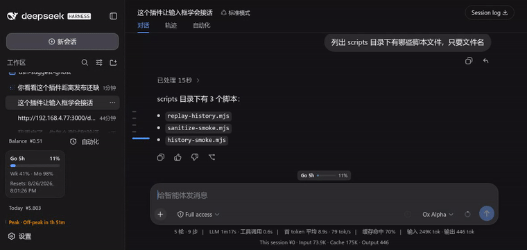
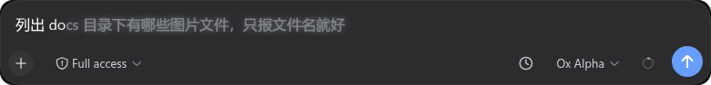
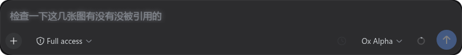

<div align="center">
  
</div>

# dsh-suggest-ghost

[](http://192.168.4.77:3000/dsh-plugins/dsh-suggest-ghost)
[](LICENSE)
[](https://github.com/deepseek-ai/deepseek-harness)

> DeepSeek Harness Web 输入预测插件：回合结束后用一次辅助 LLM 调用预测你的下一条提示词，草稿为空时以幽灵文本显示在输入框里；输入过程中则从当前会话历史找前缀补全。Tab 整条采纳，→ 逐词采纳。

## 这是什么

纯插件挂载（host 监听回合事件 + client 端 DOM overlay），不改 DSH 任何核心代码。两个模式自动切换：

- **LLM 下一条建议**（草稿为空）：每个回合完成后，把最后一轮对话脱敏后发给建议模型（默认继承主请求路由，不额外配置），产出一条「你大概率会输入的下一句」——Claude Code 同款体验。
- **历史前缀补全**（草稿非空）：zsh autosuggestions 式——从会话历史找前缀命中项，按新近度为主、会话内频次与跨会话热度为辅打分取最优，灰色显示剩余部分。全/半角标点、空白、大小写差异不影响匹配。

幽灵文本是 DOM overlay 近似渲染（跟随输入框字体、跟随滚动），不依赖官方 `setGhost` 输入机能力，rc.6 即可运行；中文输入法组合期间不拦截按键。

## 效果预览



**① 历史前缀补全**（草稿非空）——输入「列出 do」，幽灵自动补全这条历史消息的剩余部分：



**② LLM 下一条建议**（草稿为空，回合结束自动预测下一步）：



深色文字 = 已输入；灰色 = 幽灵建议。**Tab** 整条采纳，**→** 逐词采纳。幽灵文本跟随输入框字体与滚动渲染，不遮挡、不抢焦点；不合意就无视它，继续打字即消失——零成本。

## 安装

从 Gitea 一行安装（构建产物已随仓库提交，无需本地构建）：

```bash
dsh plugin --profile web add "git+http://192.168.4.77:3000/dsh-plugins/dsh-suggest-ghost.git"
```

或者源码方式：

```bash
git clone http://192.168.4.77:3000/dsh-plugins/dsh-suggest-ghost.git
cd dsh-suggest-ghost && pnpm install && pnpm run build
dsh plugin --profile web add .
```

装完重启 dsh web，页面 Ctrl+Shift+R 硬刷新。开箱即用，无需任何配置。

## 配置

全部设置在 Settings → Plugins 面板的 Suggest ghost 卡片，保存后即时生效：
卡片文案（字段 label/hint、按钮、徽章）跟随宿主 DSH 界面语言（中文 / English），
设置页切换语言后实时跟随，无需刷新；旧宿主无 locale 服务时回退中文。

| 分组 | 字段 |
|---|---|
| LLM 下一条建议 | 启用开关、输出令牌上限、建议字符上限、参考回合数、转录字符预算、超时（毫秒）、采纳快捷键、provider / model 路由（留空继承主请求） |
| 历史前缀补全 | 启用开关、跨会话搜索、最大历史条目、最少输入字符、逐词采纳 |

也可以在 cordis.patch.yml 按 id 覆盖（作为上述项的初始值）：

```yaml
- id: suggest-ghost
  config:
    maxInputBytes: 4096        # 框架化用户提示字节上限
    maxOutputTokens: 512       # 建议输出令牌上限
    timeoutMs: 60000           # 辅助请求截止时间（毫秒）
    maxRecentTurns: 1          # 送入建议模型的最近完成回合数
    maxTranscriptChars: 12000  # 转录字符预算
    maxSuggestionChars: 240    # 建议可见字符上限
    acceptKey: Tab             # 采纳快捷键
    llmEnabled: true           # LLM 建议开关
```

<div align="center">
  
  
</div>
<p align="center"><sub>Suggest ghost 设置卡片（Settings → Plugins）</sub></p>

## 安全

- 只把最后一轮对话发给建议模型（工具调用与中间推理不出本地）
- 发送前脱敏：AWS / OpenAI / GitHub / Slack / JWT / Stripe / 私钥 / Bearer 自动掩蔽
- 输出净化：ANSI / 控制符 / 双向覆盖符剥离，去围栏引号，单行化；客套话、助手口吻、反问句丢弃为「无建议」（静默跳过，不报错）
- 全程有界：输入字节 / 输出 token / 超时封顶；同回合防重入，新回合作废旧生成，卸载即中止在途请求

## 兼容性

> 在 dsh `0.1.0-rc.6` 上开发验证；client 端写法已兼容 rc.7 的严格门控 context。升级宿主版本后建议回归一遍幽灵显示与设置卡片。

## 开发

```
src/index.ts         host 入口：turn/end(completed) → 有界生成建议
src/generate.ts      转录提取 → 脱敏 → ctx.llm.stream → 净化
src/sanitize.ts      脱敏 / 净化 / 语义过滤 / 截断（纯函数）
src/settings.ts      settings 命名空间 + host→client 实时推送通道
src/hotness.ts       跨会话热度表（增量去重、内存上界）
src/projection.ts    suggestGhost 投影 last-wins fold
src/client/          幽灵渲染、历史匹配、逐词切分、快捷键、设置卡片
scripts/             冒烟测试与会话日志回放
```

```bash
pnpm run build       # tsc 编译 host + esbuild 打包 client → lib/
pnpm run test:smoke  # 纯函数冒烟测试
pnpm run replay      # 用真实会话日志回放补全管线
```

## 已知限制

- 跨会话热度表是内存态：DSH 重启后从零累积（会话内历史补全不受影响）
- LLM 建议只覆盖当前会话；把其他会话文本并作候选需开启「跨会话搜索」
- 每个完成回合都会调一次建议模型（与输入框是否有内容无关），不需要时可在设置里关闭省 token

## 许可

MIT © wujue。安全管线设计参考 [dsh-suggest-prompt](https://github.com/studyzy/dsh-suggest-prompt)（MIT）。


<div align="center">
  
</div>
